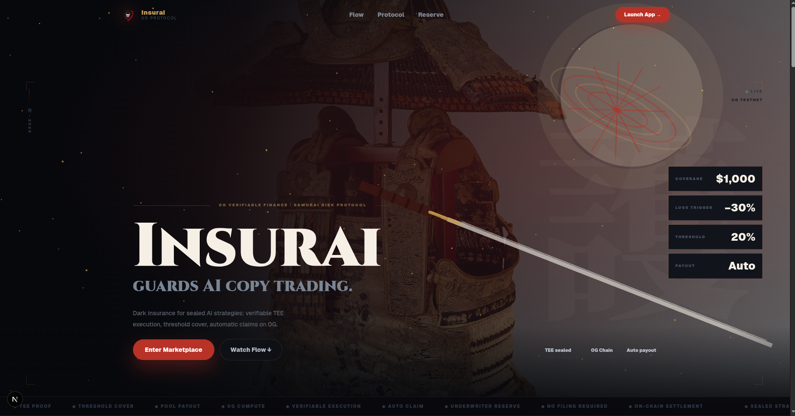
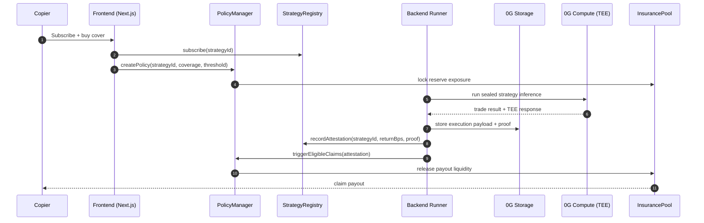
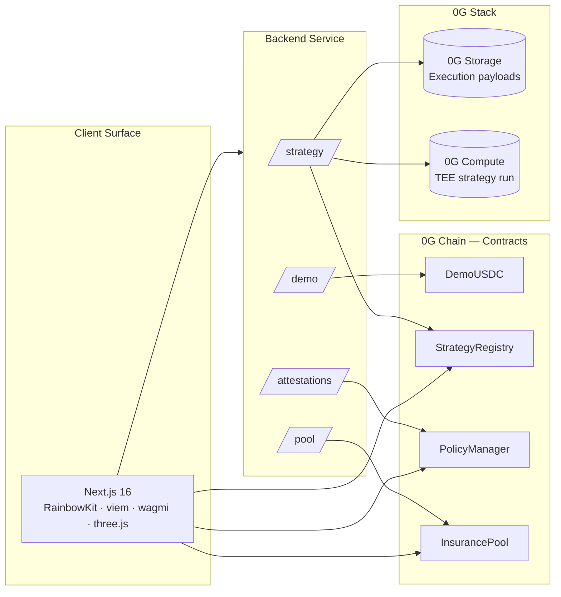

<p align="center">
  
</p>

<h1 align="center">Insurai</h1>

<p align="center">
  <strong>Insurance for sealed AI copy-trading strategies.</strong><br/>
  Strategy logic stays private. Execution stays verifiable. Claims settle automatically.
</p>

<p align="center">
  
  
  
  
  
</p>

<p align="center">
  <a href="#">Live Demo</a> ·
  <a href="#how-it-works">How It Works</a> ·
  <a href="#architecture">Architecture</a> ·
  <a href="#0g-integration">0G Integration</a> ·
  <a href="#local-development">Run Locally</a>
</p>

---

## Overview

Insurai is a verifiable insurance layer for AI copy trading on 0G. Strategy providers register sealed AI trading agents, copiers subscribe and buy coverage, and underwriters supply liquidity to a reserve pool that pays claims when a strategy breaches a loss threshold.

The protocol uses **0G Chain** for policies, subscriptions, pool accounting, and claim settlement; **0G Storage** for execution payloads and attestations; and **0G Compute** for TEE-backed strategy execution. The result is a copy-trading marketplace where users can verify performance without forcing strategy providers to reveal the prompt, model logic, or trade system.

- **Private strategy logic** — providers publish hashes and storage roots, not raw strategy prompts
- **Verifiable execution** — backend records TEE acknowledgements, proof hashes, market fingerprints, and trade returns
- **Insurance-native UX** — copiers buy coverage with explicit loss thresholds and automatic claim rules
- **Underwriter yield** — liquidity providers earn premium flow while backing claim payouts

---

## The Problem

AI copy trading has a trust problem: the best strategies cannot be fully public, but users do not want to follow a black box with no protection.

> **Copy trading needs both privacy for strategy providers and safety for copiers.**

| Today's option | Why it fails |
|---|---|
| Public strategy bots | Edge disappears once the strategy is copied |
| Private AI trading agents | Users cannot verify what happened or why losses occurred |
| DeFi vaults | Pooled exposure, limited per-strategy insurance logic |
| Manual insurance claims | Slow, subjective, and disconnected from execution attestations |

Insurai makes insurance the missing primitive: users can follow sealed strategies, verify the execution trail, and receive automatic payout when the configured loss threshold is crossed.

---

## How It Works

> Scenario: a copier wants to follow an AI strategy, but only if a severe drawdown is covered.

1. **Provider registers strategy** — the provider registers a strategy on `StrategyRegistry` with a TEE agent hash, 0G Storage root, config hash, fee, and risk score.
2. **Copier subscribes** — the copier subscribes to the strategy and buys a policy through `PolicyManager`.
3. **Premium is priced** — the contract calculates premium from coverage amount, risk score, and loss threshold.
4. **Underwriter backs the risk** — underwriters deposit dUSDC into `InsurancePool`, creating available claim capacity.
5. **Strategy executes in 0G Compute** — backend requests sealed AI execution, stores the payload on 0G Storage, and submits an attestation on-chain.
6. **Loss is measured** — if the attested return breaches the policy threshold, claim status is triggered.
7. **Payout settles automatically** — `PolicyManager` pulls liquidity from `InsurancePool` and pays the protected copier.

**Result:** strategy providers keep their edge private, copiers get a defined safety net, and underwriters earn premium yield for taking quantified risk.

---

## Architecture

### Claim Flow



### System Components



---

## The Three Actors

| Actor | Stake | Earns / Receives | Loses If |
|---|---|---|---|
| **Strategy Provider** | Registers sealed AI strategy and submits execution attestations | Subscription fees and reputation from verified performance | Bad returns raise premiums and reduce copier demand |
| **Copier** | Subscribes to a strategy and buys insurance cover | Strategy access plus payout protection after threshold loss | Premium is spent if no claim event occurs |
| **Underwriter** | Deposits dUSDC into the insurance pool | Premium yield from active policies | Pool pays claims when insured strategies breach thresholds |

Every actor is aligned around verifiable performance. Good strategies attract more copiers, insured demand creates more premium flow, and poor strategies become more expensive to cover.

---

## 0G Integration

Insurai is built around the 0G stack. Removing any layer weakens a core guarantee.

| 0G Layer | How Insurai Uses It | Files |
|---|---|---|
| **0G Chain** | Strategy registry, subscriptions, policies, premium pricing, pool deposits, utilization, and claim settlement. | `sc/src/*.sol`, `fe/src/lib/chain.ts`, `be/src/services/chain.ts` |
| **0G Storage** | Execution payloads, market fingerprints, proof hashes, and attestation artifacts are archived as storage roots for auditability. | `be/src/services/zgStorage.ts` |
| **0G Compute (TEE)** | Strategy runner requests sealed AI execution and requires TEE acknowledgement/response before creating attestations. | `be/src/services/zgCompute.ts`, `be/src/routes/strategy.ts` |
| **0G Explorer / Chain State** | Policy state, pool reserves, strategy metadata, attestations, and claim outcomes remain inspectable on-chain. | `sc/deployments/latest.json`, `fe/src/context/AppContext.tsx` |

### Why 0G, not AWS + Ethereum

| Requirement | AWS + Ethereum | 0G |
|---|---|---|
| Strategy privacy | Off-chain operator can inspect logic | TEE-backed compute path |
| Execution audit trail | App database is the source of truth | Storage roots + on-chain attestations |
| Claim settlement | Requires trusted backend decisions | Contract-driven policy and pool logic |
| AI x Web3 coherence | Services are stitched together manually | Chain, Storage, and Compute are first-class primitives |

---

## Key Security Primitive — Attested Loss Triggers

Insurai does not pay claims from a manual form. It pays from an execution trail.

```text
STRATEGY RUN                         CLAIM CHECK
────────────                         ───────────
market data snapshot                 policy coverage + threshold
        │                                      │
        ▼                                      ▼
0G Compute TEE                         StrategyRegistry attestation
        │                                      │
        ▼                                      ▼
trade return in basis points ───────▶ PolicyManager checks loss
        │                                      │
        ▼                                      ▼
0G Storage payload root                  InsurancePool payout
        │                                      │
        ▼                                      ▼
on-chain attestation                 copier receives dUSDC
```

**Invariant:** a copier claim is tied to a recorded strategy result, a policy threshold, and reserve liquidity. The backend can submit attestations, but contracts enforce policy state and payout accounting.

---

## 0G APAC Hackathon 2026

Submission to the **0G APAC Hackathon** targeting **Track 3: Agentic Economy — Verifiable Finance**.

| Hackathon Requirement | Where to Find It |
|---|---|
| 0G contract addresses | See [Deployed Contracts](#deployed-contracts--0g-galileo-testnet-chain-id-16602) |
| 0G core component integration | Chain + Storage + Compute mapped in [0G Integration](#0g-integration) |
| Demo flow | Marketplace, policy wizard, provider runner, underwriter pool, claim center |
| Architecture & docs | This README |
| Local reproduction steps | See [Local Development](#local-development) |

**Why Insurai fits the 0G thesis:** the product depends on private AI execution, verifiable attestations, durable storage, and on-chain settlement. Without 0G, either the strategy provider loses privacy or the copier loses trust.

---

## Deployed Contracts — 0G Galileo Testnet (Chain ID 16602)

| Contract | Address | Purpose |
|---|---|---|
| `DemoUSDC` | [`0x5C789abC439d69E4b66160214254DC04EE3e5341`](https://chainscan-galileo.0g.ai/address/0x5C789abC439d69E4b66160214254DC04EE3e5341) | Demo stablecoin used for subscriptions, premiums, deposits, and payouts |
| `StrategyRegistry` | [`0x6CE2C0e89BAFaafa50762d0728012cFbb96D0d00`](https://chainscan-galileo.0g.ai/address/0x6CE2C0e89BAFaafa50762d0728012cFbb96D0d00) | Strategy metadata, subscriptions, and execution attestations |
| `InsurancePool` | [`0xB3C6f054DD1841dA7832a695704BdbB4A4c8D038`](https://chainscan-galileo.0g.ai/address/0xB3C6f054DD1841dA7832a695704BdbB4A4c8D038) | Underwriter deposits, premium reserve, utilization, claim payouts |
| `PolicyManager` | [`0x73a3Bbd0e0961292F6BdF5d3017A70c06A0b2ef2`](https://chainscan-galileo.0g.ai/address/0x73a3Bbd0e0961292F6BdF5d3017A70c06A0b2ef2) | Policy creation, premium calculation, claim trigger, payout routing |

Seed strategy IDs:

| Strategy | ID | Risk |
|---|---:|---|
| Stablecare Alpha | `1` | Low |
| Pulse Momentum | `2` | Medium |
| Liquid Wellness | `3` | Low |

---

## What's Shipped

```text
sc/    4 contracts · Foundry · strategy registry · policy manager · pool · demo USDC
fe/    Next.js 16 · React 19 · viem · wagmi · RainbowKit · three.js · 7 app surfaces
be/    Express · TypeScript · viem/ethers · 0G Compute · 0G Storage · attestation routes
```

- Sealed strategy marketplace with TEE verification labels
- Policy purchase wizard with coverage, threshold, premium, and approval flow
- Copier portfolio and claim center
- Provider dashboard for TEE strategy run + forced loss demo
- Underwriter pool with deposits, utilization, premiums, and exposure
- Partnership page for ecosystem onboarding
- Samurai-inspired landing page with Insurai brand assets

---

## Repository Layout

```text
Insurai/
├── sc/                              Solidity contracts (Foundry)
│   ├── src/
│   │   ├── DemoUSDC.sol             Demo stablecoin
│   │   ├── StrategyRegistry.sol     Strategies, subscribers, attestations
│   │   ├── InsurancePool.sol        Underwriter reserve + claim liquidity
│   │   └── PolicyManager.sol        Policies, premiums, claim triggers
│   ├── test/Protocol.t.sol
│   ├── script/Deploy.s.sol
│   └── deployments/latest.json
├── be/                              Backend runner / oracle service
│   └── src/
│       ├── routes/                  pool · strategy · attestations · demo
│       └── services/                0G Compute · 0G Storage · 0G Chain
└── fe/                              Next.js 16 frontend
    └── src/app/
        ├── page.tsx                 Landing
        └── (app)/                   marketplace · portfolio · claims · provider · underwriter · partnership
```

---

## Local Development

### Smart contracts

```bash
cd sc
forge install
forge build
forge test
forge script script/Deploy.s.sol --rpc-url https://evmrpc-testnet.0g.ai --broadcast
```

Env:

```text
PRIVATE_KEY=...
DEPLOY_OUTPUT=deployments/latest.json
JUDGE_WALLET=0x...
SEED_POOL_AMOUNT=0
```

### Backend service

```bash
cd be
npm install
cp .env.example .env
npm run dev
```

Important env:

```text
ZG_CHAIN_ID=16602
ZG_RPC_URL=https://evmrpc-testnet.0g.ai
PROVIDER_PRIVATE_KEY=...
STRATEGY_REGISTRY_ADDRESS=...
POLICY_MANAGER_ADDRESS=...
INSURANCE_POOL_ADDRESS=...
USDC_ADDRESS=...
ZG_COMPUTE_PROVIDER_ADDRESS=...
ZG_STORAGE_RPC=https://rpc-storage.0g.ai
ZG_STORAGE_INDEXER_RPC=https://indexer-storage-turbo.0g.ai
PORT=3001
```

### Frontend

```bash
cd fe
npm install
npm run dev
```

App runs on `http://localhost:3000` and defaults to 0G Galileo Testnet (`16602`).

Optional frontend env:

```text
NEXT_PUBLIC_ZG_RPC_URL=https://evmrpc-testnet.0g.ai
NEXT_PUBLIC_API_BASE_URL=http://localhost:3001
NEXT_PUBLIC_USDC_ADDRESS=...
NEXT_PUBLIC_STRATEGY_REGISTRY_ADDRESS=...
NEXT_PUBLIC_INSURANCE_POOL_ADDRESS=...
NEXT_PUBLIC_POLICY_MANAGER_ADDRESS=...
```

---

## Developer Feedback for 0G

Notes from building Insurai on the 0G stack:

- **Compute provider setup:** provider address selection and funding status should be easier to inspect from the SDK.
- **TEE response ergonomics:** a simple typed attestation object would make frontend trust UX easier to build.
- **Storage docs:** clearer examples for pairing storage RPC and indexer URLs would reduce integration time.
- **Explorer consistency:** stable explorer URLs per chain make README and demo verification easier.

---

## Roadmap Post-Hackathon

1. **Q2 2026** — Production-grade TEE attestation display, richer policy pricing, multi-strategy cover bundles.
2. **Q3 2026** — Permissionless strategy onboarding, risk oracle, automated reinsurance layer.
3. **Q4 2026** — Institutional underwriter vaults, dynamic premium curves, cross-strategy portfolio coverage.

---

## Team

| | Role |
|---|---|
| **Faisal** | Smart contracts, full-stack, 0G integration |

---

## License

MIT. Built for the 0G APAC Hackathon, May 2026.
